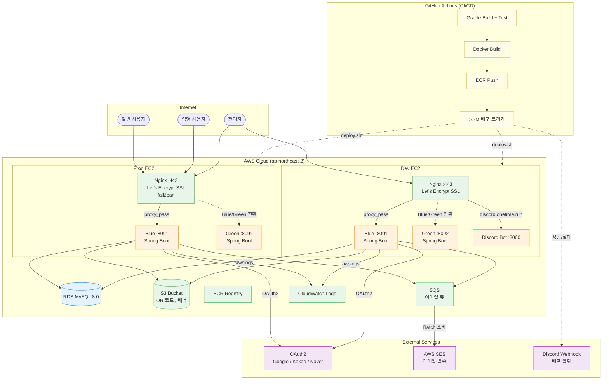

# OneTime Backend


## System Architecture



### Infrastructure Overview

| 구분 | Dev | Prod |
|------|-----|------|
| EC2 | Ubuntu, Docker Compose | Ubuntu, Docker Compose |
| 웹서버 | Nginx (Let's Encrypt SSL) | Nginx (Let's Encrypt SSL, fail2ban) |
| 배포 | Blue/Green 무중단 | Blue/Green 무중단 |
| 로깅 | CloudWatch Logs | CloudWatch Logs |
| 알림 | Discord Webhook | Discord Webhook |

### Deployment Flow

```
GitHub Actions → Gradle Build → Docker Build → ECR Push → SSM → deploy.sh
                                                                    ↓
                                              비활성 컨테이너 시작 (Blue/Green)
                                                                    ↓
                                              Health Check (20s 대기 + 120s 타임아웃)
                                                                    ↓
                                              Nginx 라우팅 전환 + 이전 컨테이너 종료
                                                                    ↓
                                              Discord 성공/실패 알림
```

## Tech Stack

| 구분 | 기술 |
|------|------|
| Language | Java 17 |
| Framework | Spring Boot 3.3.2 |
| Database | MySQL 8.0, Spring Data JPA, QueryDSL 5.0 |
| Security | Spring Security, OAuth2 (Google/Kakao/Naver), JWT + Token Rotation |
| Cloud | AWS EC2, ECR, S3, SQS, SES, SSM, CloudWatch |
| Email | SQS (비동기 큐) → Batch → SES (발송) |
| Admin | Thymeleaf + Tailwind CSS + Chart.js (반응형, 다크 모드, PWA) |
| CI/CD | GitHub Actions → Docker → ECR → SSM → Blue/Green 배포 |
| Documentation | Spring REST Docs 3.0.0, SpringDoc OpenAPI 2.1.0 |
| Build | Gradle 8.x |

## Key Features

### Event Scheduling
- 날짜(DATE) / 요일(DAY) 기반 이벤트 생성 및 확정
- 회원(OAuth2) + 비회원(PIN) 이중 참여 모델
- 스케줄 배치 INSERT (`JdbcTemplate.batchUpdate()`)
- QR 코드 생성 (ZXing → S3)
- URL 단축 (Base62)

### Authentication & Security
- OAuth2 소셜 로그인 (Google, Kakao, Naver)
- JWT Access Token + MySQL 기반 Refresh Token Rotation
- Grace Period (3초) 동시 요청 허용, 탈취 시 Family 전체 Revoke
- Admin BCrypt 비밀번호 해싱
- HttpOnly + Secure + SameSite=Lax 쿠키
- XSS 방지 (escapeHtml), CSV Formula Injection 방지

### Admin Dashboard (`/admin/*`)
- **대시보드**: KPI 카드 7개 + 차트 4개 (가입 추이, OAuth 비율, 요일별 이벤트, 키워드 TOP)
- **유저 통계**: 목록 (페이징/검색/정렬), 상세 모달, CSV 내보내기
- **이벤트 통계**: 확정 트래킹 (확정률/확정자 유형/카테고리별/일별 추이), 히트맵, CSV 내보내기
- **리텐션 분석**: MAU 추이, 전환 퍼널, TTV 분포, WAU/MAU Stickiness, 코호트 리텐션
- **마케팅 타겟**: 6개 그룹별 유저 선택 → 이메일 발송
- **이메일 시스템**: 그룹/개별 발송, 템플릿 CRUD, 발송 로그, SQS 비동기 큐
- **배너 관리**: 캐러셀/띠배너 CRUD, 스테이징 내보내기/불러오기

## Branch Strategy

| 브랜치 | 설명 | CI/CD |
|--------|------|-------|
| `main` | 프로덕션 | PR 병합 시 prod-cicd 실행 |
| `release/v*` | 스테이징 검수 | - |
| `develop` | 개발 통합 | PR 병합 시 test-cicd 실행 |
| `feature/#<issue>/<name>` | 기능 개발 | - |
| `hotfix/<description>` | 긴급 수정 | - |

## Getting Started

```bash
# Build
./gradlew clean build

# Run (local)
./gradlew bootRun --args='--spring.profiles.active=local'

# Test
./gradlew test

# Docker
docker build -t onetime-backend .
docker run -p 8090:8090 onetime-backend
```

## API

- **Swagger UI**: `/swagger-ui.html`
- **Admin Dashboard**: `/admin/dashboard`
- **API Prefix**: `/api/v1/*`

| Category | Endpoints |
|----------|-----------|
| Event | 생성, 조회, 수정, 확정, QR 코드 |
| Schedule | 회원/비회원 시간 선택, 필터링 |
| User | OAuth 온보딩, 프로필, 고정 스케줄 |
| Member | 비회원 등록/로그인 (PIN) |
| Token | JWT 재발급 (Token Rotation) |
| Admin | 로그인, 통계, 이메일, 배너, CSV 내보내기 |
| URL | 단축 URL 생성/리다이렉트 |

## Project Structure

```
src/main/java/side/onetime/
├── controller/          # REST API endpoints
├── service/             # Business logic + EmailEventPublisher (SQS)
├── repository/          # Data access (JPA, QueryDSL, Native Query)
│   └── custom/          # QueryDSL Custom Repository implementations
├── domain/              # JPA entities (Soft Delete pattern)
│   └── enums/           # Status enums (EventStatus, EmailLogStatus, etc.)
├── dto/                 # DTOs organized by feature
│   └── admin/           # Admin 전용 (statistics, email, banner)
├── auth/                # OAuth2, JWT, @IsAdmin/@IsUser/@PublicApi
├── global/
│   ├── config/          # SecurityConfig, SqsConfig, CacheConfig
│   ├── filter/          # JwtFilter (토큰 자동 재발급)
│   └── common/          # ApiResponse<T>, SuccessStatus, ErrorStatus
├── exception/           # CustomException, GlobalExceptionHandler
└── util/                # JwtUtil, CookieUtil, S3Util, DateUtil

src/main/resources/
├── templates/admin/     # Thymeleaf 어드민 페이지 (반응형 + 다크 모드)
│   ├── layout/          # 공통 레이아웃
│   ├── fragments/       # 사이드바, 탑바, 모달, 날짜 필터
│   └── *.html           # 대시보드, 유저, 이벤트, 리텐션, 마케팅, 이메일, 배너
└── static/admin/        # 정적 리소스 (favicon, manifest.json)
```

## Documentation

상세 설계 및 기능 명세는 `docs/` 디렉터리를 참고하세요.

```
docs/
├── ARCHITECTURE.md      # 아키텍처 & 기술 선정 이유
├── design/              # 기능 설계 문서 (구현 전 설계 검토용)
├── features/            # 구현된 기능 명세
├── plans/               # 구현 계획
└── security/            # 보안 관련 (gitignore)
```