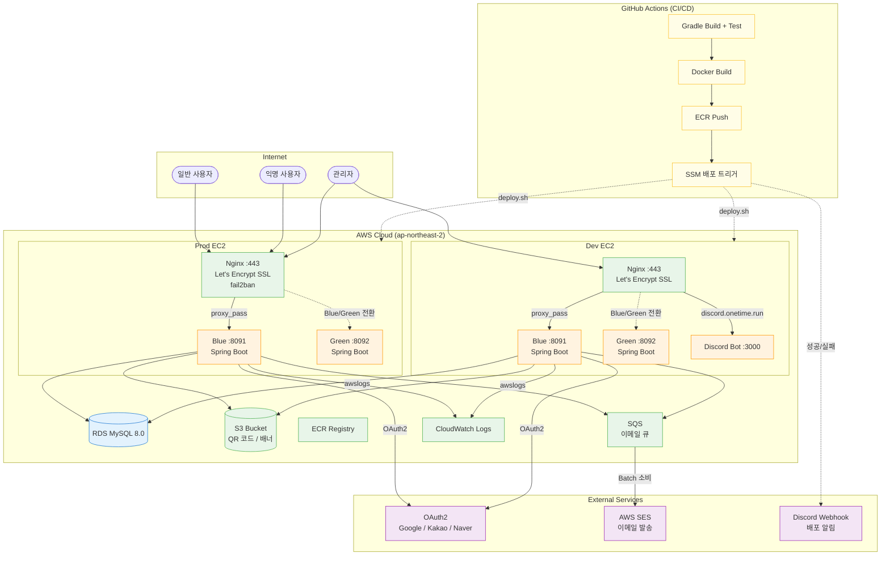
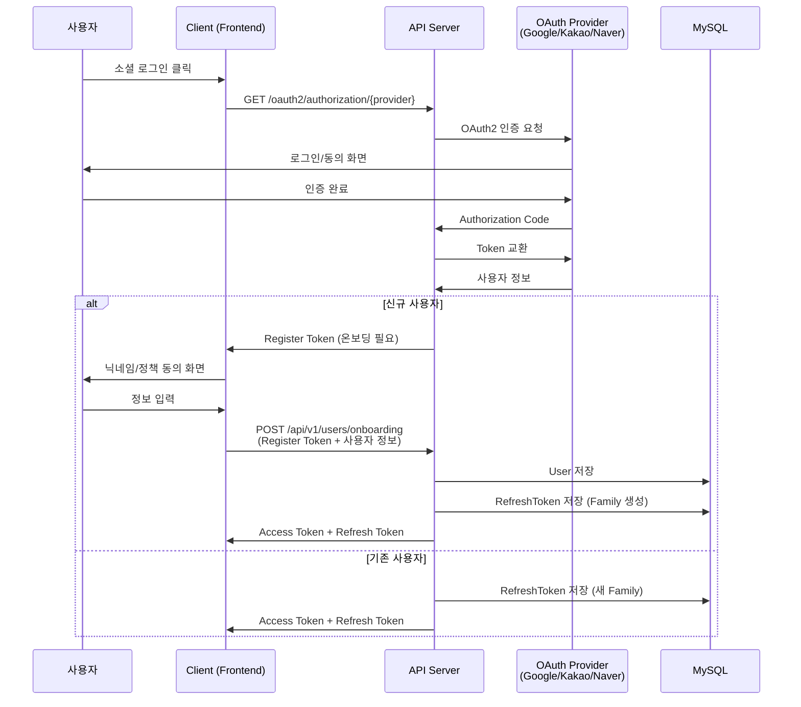
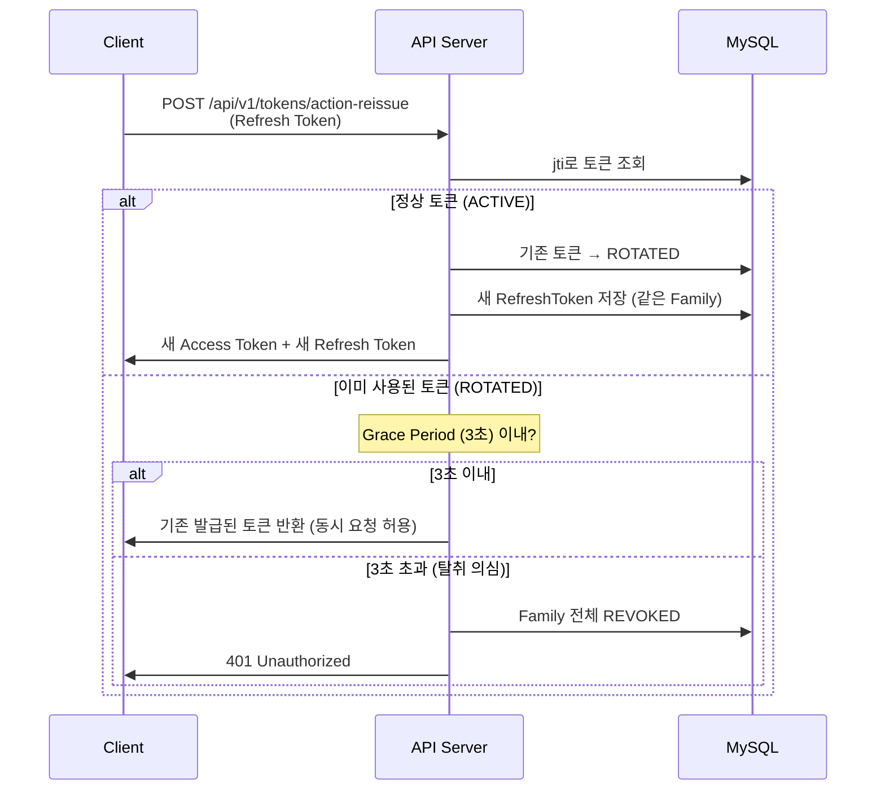
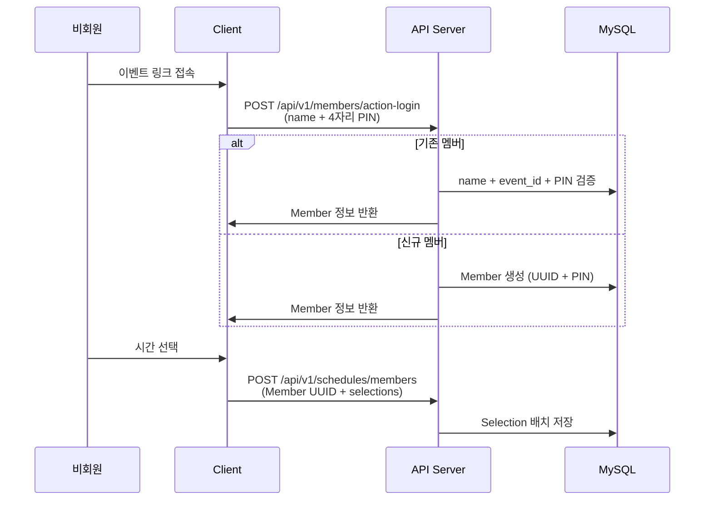
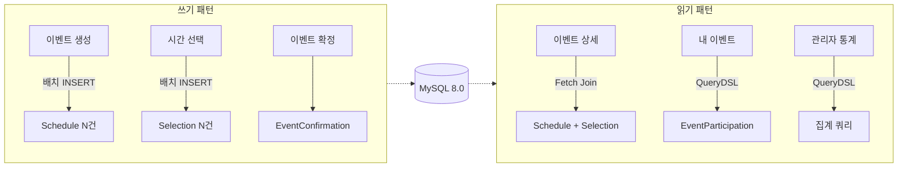
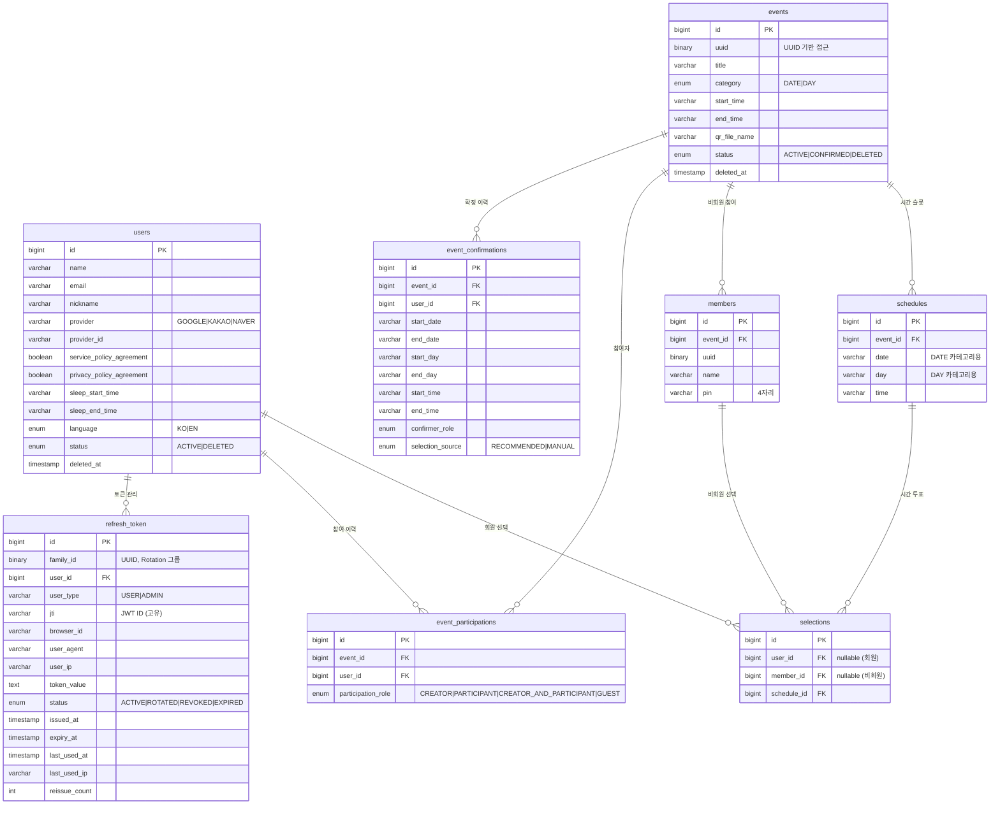
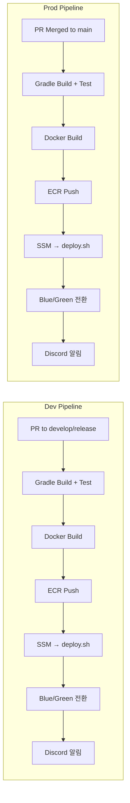

# OneTime - 아키텍처 & 기술 선정 이유

> 최종 업데이트: 2026-03-17

이 문서는 OneTime(일정 조율 서비스) 백엔드의 기술 스택과 아키텍처를 설명한다. 익명·회원 모두 참여 가능한 이벤트 스케줄링, OAuth2 소셜 로그인, Token Rotation 기반 보안이라는 도메인 요구사항 위에서 **"왜 이것을 골랐는가"에** 초점을 맞춘다.

---

## 아키텍처 개요



**핵심 구조:**
- **Blue/Green 무중단 배포**: Docker Compose로 Blue(:8091)/Green(:8092) 컨테이너 교대 실행, Nginx가 라우팅 전환
- **이중 인증 모델**: 회원(OAuth2 JWT) + 비회원(4자리 PIN)이 동일 이벤트에 참여
- **이메일 비동기**: API → SQS 발행 → Batch 서버에서 SES 발송
- **환경 분리**: Dev(`dev-api.onetime.run`) / Prod(`api.onetime.run`) 별도 EC2

---

## 기술 스택 선정 이유

### Spring Boot 3.3.2 + Java 17

**왜 Spring Boot인가:** 팀원 전원이 Java/Spring 생태계에 익숙하고, OAuth2 Client·Spring Security·Spring Data JPA 등 필요한 모든 기능이 스타터로 제공된다. 사이드 프로젝트에서 빠른 개발 속도가 핵심이었다.

**왜 Java 17인가:** 프로젝트 시작 시점(2024년)에서 LTS 안정 버전이었다. Record, sealed class, text block 등 생산성 향상 기능을 활용한다.

| 탈락 후보 | 이유 |
|-----------|------|
| Node.js (Express/Nest) | 팀 Java 역량 활용, 타입 안전성 우선 |
| Kotlin + Spring | 팀 러닝커브 고려, Java로 충분 |
| Java 21 | 프로젝트 시작 시점 LTS 안정성 우선 |

### Spring Security + OAuth2 Client

**왜 OAuth2인가:** 일정 조율 서비스에서 회원가입 허들을 낮추는 것이 핵심이다. Google·Kakao·Naver 세 곳을 지원하여 한국 사용자 대부분을 커버한다.

**왜 JWT인가:** 서버 세션을 유지하지 않는 Stateless 구조로, 수평 확장이 용이하다. Access Token(단기)과 Refresh Token(장기, DB 저장)으로 분리하여 보안과 사용성을 양립한다.

| 탈락 후보 | 이유 |
|-----------|------|
| Session 기반 인증 | 서버 확장 시 세션 공유 필요, Redis 의존성 증가 |
| Firebase Auth | 벤더 종속, 커스텀 로직 제한 |
| Passport.js | Node.js 전용 |

### Token Rotation (MySQL 기반)

**왜 Token Rotation인가:** Refresh Token 탈취 시 피해를 최소화한다. 토큰 사용마다 새 토큰을 발급하고, 이전 토큰의 재사용을 감지하면 해당 Family 전체를 폐기(Revoke)한다.

**왜 Redis가 아닌 MySQL인가:** 인프라 단순화가 우선이었다. Refresh Token의 수명은 30일로 길고, 재발급 빈도는 분 단위가 아니므로 MySQL로 충분하다. Grace Period(3초)로 동시 요청에 의한 오탐을 방지한다.

| 탈락 후보 | 이유 |
|-----------|------|
| Redis | 별도 인프라 운영 비용, 사이드 프로젝트에 과도 |
| Token Blacklist | 블랙리스트 조회 비용, Rotation 대비 보안 약함 |
| 단순 Refresh Token | 탈취 시 만료까지 무방비 |

### QueryDSL 5.0

**왜 QueryDSL인가:** 이벤트 참여자 필터링, 소프트 삭제 조건, 토큰 Family 조회 등 복잡한 동적 쿼리가 필요하다. JPQL 문자열 대신 타입 세이프 쿼리로 컴파일 타임에 오류를 잡는다.

**왜 Criteria API가 아닌가:** Criteria API는 가독성이 현저히 떨어진다. QueryDSL은 SQL과 유사한 문법으로 코드 리뷰가 쉽다.

| 탈락 후보 | 이유 |
|-----------|------|
| JPA Criteria API | 가독성 최악, 유지보수 어려움 |
| Native Query | 타입 안전 없음, DB 종속 |
| jOOQ | JPA와의 통합 복잡, 라이센스 이슈 |

### Spring Data JPA + 배치 Insert

**왜 JPA인가:** User, Event, Schedule, Selection 등 도메인 엔티티 간 관계(1:N, M:N)가 복잡하다. 연관관계 매핑과 지연 로딩으로 객체 그래프 탐색이 자연스럽다.

**왜 배치 Insert인가:** 이벤트 생성 시 날짜 × 시간 조합으로 수십~수백 개의 Schedule을 한 번에 생성한다. `ScheduleBatchRepository`와 `SelectionBatchRepository`에서 `JdbcTemplate.batchUpdate()`를 사용하여 JPA 개별 INSERT 대비 성능을 크게 개선한다.

| 탈락 후보 | 이유 |
|-----------|------|
| MyBatis | 도메인 객체 간 관계 매핑 불편, 엔티티 상태 관리 부재 |
| Spring JDBC 단독 | ORM 장점 포기, 보일러플레이트 증가 |

### AWS S3 + ZXing (QR 코드)

**왜 S3인가:** 이벤트별 QR 코드 이미지와 관리자 배너 이미지를 저장한다. 정적 파일 서빙에 최적화되어 있고, CloudFront 연동 시 글로벌 배포가 가능하다.

**왜 ZXing인가:** Java 네이티브 QR 코드 생성 라이브러리 중 가장 성숙하고, 별도 외부 서비스 없이 서버에서 직접 QR을 생성하여 S3에 업로드한다.

| 탈락 후보 | 이유 |
|-----------|------|
| 외부 QR API | 네트워크 의존성, 비용 발생 |
| Google Chart API | 서비스 종료 위험, 커스터마이징 제한 |

### Spring REST Docs + SpringDoc OpenAPI

**왜 둘 다 사용하는가:** REST Docs는 테스트 기반 문서 생성으로 API 스펙의 정확성을 보장하고, SpringDoc OpenAPI는 Swagger UI로 프론트엔드 팀과의 협업 효율을 높인다.

| 탈락 후보 | 이유 |
|-----------|------|
| Swagger 단독 | 테스트 기반 검증 부재, 스펙 불일치 위험 |
| REST Docs 단독 | 인터랙티브 API 테스트 불가 |

---

## 인증/인가 흐름

### OAuth2 로그인 + 온보딩



### Token Rotation 흐름



### 비회원 참여 흐름



---

## 데이터 흐름



**핵심 패턴:**
- **쓰기:** `ScheduleBatchRepository`, `SelectionBatchRepository`로 `JdbcTemplate.batchUpdate()` 사용. JPA `saveAll()` 대비 10배 이상 빠른 대량 INSERT.
- **읽기:** QueryDSL Custom Repository로 N+1 방지 (`fetchJoin`), 소프트 삭제 조건 자동 적용 (`@SQLRestriction`).

---

## DB 스키마



**핵심 설계 결정:**
- **이중 FK (selections):** `user_id`와 `member_id`가 각각 nullable. 회원이면 `user_id`, 비회원이면 `member_id`로 연결하여 하나의 selections 테이블로 통합한다.
- **이벤트 카테고리 (DATE/DAY):** DATE는 특정 날짜(2024-01-15), DAY는 요일(월, 화)로 구분. Schedule의 `date`와 `day` 컬럼 중 카테고리에 맞는 것만 사용한다.
- **소프트 삭제:** User는 `status = ACTIVE/DELETED`, Event는 `status = ACTIVE/CONFIRMED/DELETED`. `@SQLDelete`와 `@SQLRestriction`으로 JPA 레벨에서 자동 처리한다.
- **Token Rotation Family:** `family_id`(UUID)로 같은 로그인 세션의 토큰을 그룹화한다. 탈취 감지 시 Family 전체를 REVOKED 처리하여 공격자의 토큰도 무효화한다.

---

## API 구조

### 주요 엔드포인트

| Method | Endpoint | 인증 | 설명 |
|--------|----------|------|------|
| GET | `/api/v1/events/{event_id}` | Public | 이벤트 상세 조회 |
| POST | `/api/v1/events` | Public | 이벤트 생성 |
| GET | `/api/v1/events/users/all` | `@IsUser` | 내 이벤트 목록 |
| POST | `/api/v1/schedules/members` | Public | 비회원 시간 선택 |
| POST | `/api/v1/schedules/users` | `@IsUser` | 회원 시간 선택 |
| POST | `/api/v1/users/onboarding` | Public | OAuth 온보딩 |
| POST | `/api/v1/tokens/action-reissue` | Public | 토큰 재발급 |
| POST | `/api/v1/members/action-login` | Public | 비회원 로그인 |
| GET | `/api/v1/urls/{shortened_url}` | Public | URL 리다이렉트 (Base62) |
| PUT | `/api/v1/events/{event_id}/confirm` | Public | 이벤트 확정 |
| POST | `/api/v1/admin/login` | Public | 관리자 로그인 |
| GET | `/api/v1/admin/statistics/*` | `@IsAdmin` | 관리자 통계 |
| GET | `/api/v1/admin/statistics/events/confirmation` | `@IsAdmin` | 이벤트 확정 통계 |
| POST | `/api/v1/test/auth/login` | Public (local/dev만) | E2E 테스트 로그인 |

### URL 체계

- `/api/v1/*` — REST API
- `/oauth2/authorization/{provider}` — OAuth2 로그인 진입점
- `/admin/*` — 관리자 대시보드 (Thymeleaf)

---

## 보안

| 레이어 | 전략 |
|--------|------|
| 인증 | OAuth2 (Google/Kakao/Naver) + JWT Access Token |
| 인가 | `@IsUser`, `@IsAdmin`, `@IsMasterAdmin` 어노테이션 |
| Admin 비밀번호 | BCrypt 해싱 (`BCryptPasswordEncoder`) |
| Refresh Token | MySQL 기반 Token Rotation + Grace Period (3초) |
| 비회원 보안 | 4자리 PIN + Event UUID 조합 |
| 쿠키 보안 | HttpOnly, Secure (항상), SameSite=Lax |
| CORS | 허용 Origin 명시적 설정 (localhost, 프로덕션 도메인) |
| CSV 보안 | Formula injection 방지 (`=`, `+`, `-`, `@` prefix 이스케이프) |
| XSS 방지 | `escapeHtml()` 유틸, Thymeleaf `th:text` 자동 이스케이프 |
| 소프트 삭제 | `@SQLDelete` + `@SQLRestriction`으로 데이터 보존 |
| 시크릿 관리 | 환경변수 (`${JWT_SECRET}`, OAuth 클라이언트 시크릿) |
| 토큰 탈취 대응 | Family 전체 Revoke, IP/User-Agent 변경 로깅 |

---

## 에러 처리

```
GlobalExceptionHandler
├── CustomException (도메인별 에러)
│   ├── UserErrorStatus     — 사용자 관련
│   ├── EventErrorStatus    — 이벤트 관련
│   ├── TokenErrorStatus    — 토큰 관련
│   ├── ScheduleErrorStatus — 스케줄 관련
│   ├── AdminErrorStatus    — 관리자 관련
│   └── TestErrorStatus     — 테스트 관련
└── ApiResponse<T> (통일 응답 포맷)
    ├── SuccessStatus
    └── ErrorStatus
```

**응답 형식:** 모든 API가 `ApiResponse<T>` 래퍼로 일관된 형식 반환. 도메인별 `ErrorStatus` 열거형으로 에러 코드를 분류하여 프론트엔드 팀과 에러 핸들링을 표준화한다.

---

## CI/CD



| 환경 | 트리거 | 도메인 | 배포 방식 |
|------|--------|--------|----------|
| Dev | PR to develop/release | `dev-api.onetime.run` | ECR → SSM → Blue/Green |
| Prod | PR Merged to main | `api.onetime.run` | ECR → SSM → Blue/Green |

**배포 흐름 (deploy.sh):**
1. ECR 로그인 + Docker 이미지 Pull
2. 비활성 컨테이너(Blue/Green) 시작
3. Health Check (20초 대기 + 120초 타임아웃)
4. Nginx 라우팅 전환 (`nginx -t` + `reload`)
5. 이전 컨테이너 종료
6. Discord 성공/실패 알림

**Docker 구성:**
- 베이스: `amazoncorretto:17-alpine-jdk`
- Blue: `:8091` → `:8090` (컨테이너 내부)
- Green: `:8092` → `:8090` (컨테이너 내부)
- 로깅: `awslogs` 드라이버 → CloudWatch

**추가 워크플로우:**
- `commit-labeler.yaml` — 커밋 타입별 PR 자동 라벨링 (feat, fix, refactor 등)
- `auto-assign.yaml` — PR 자동 담당자 배정

---

## 테스트

| 도구 | 용도 |
|------|------|
| JUnit 5 | 단위·통합 테스트 |
| Testcontainers (MySQL) | 실제 DB로 통합 테스트 |
| MockMvc | Controller 레이어 테스트 |
| Spring REST Docs | 테스트 기반 API 문서 생성 |
| TestAuthService | local/dev 환경 E2E 테스트용 로그인 |

---

## 스케줄러

| 스케줄러 | 크론 | 설명 |
|---------|------|------|
| RefreshTokenCleanupScheduler | `0 0 3 * * *` | 만료 토큰 상태 갱신 (EXPIRED) |
| RefreshTokenCleanupScheduler | `0 30 3 * * *` | 30일 경과 토큰 물리 삭제 |
| EventCleanupScheduler | 설정값 | 소프트 삭제된 이벤트 정리 |

---

## 핵심 의존성 버전

| 의존성 | 버전 | 용도 |
|--------|------|------|
| Spring Boot | 3.3.2 | 프레임워크 |
| Java | 17 | 언어 |
| Spring Security | Boot 관리 | 인증/인가 |
| Spring Data JPA | Boot 관리 | DB 접근 |
| QueryDSL | 5.0.0 (Jakarta) | 동적 쿼리 |
| JJWT | 0.12.2 | JWT 생성/검증 |
| Spring Cloud AWS | 3.1.1 | S3, 인프라 |
| Spring Cloud OpenFeign | 4.1.4 | HTTP 클라이언트 |
| SpringDoc OpenAPI | 2.1.0 | Swagger UI |
| Spring REST Docs | 3.0.0 | API 문서 생성 |
| ZXing | 3.5.1 | QR 코드 생성 |
| Logstash Logback Encoder | 8.1 | JSON 구조화 로깅 |
| Jsoup | 1.21.2 | HTML 파싱 |
| Testcontainers | Boot 관리 | 통합 테스트 |

> 2026-02-18 기준 `build.gradle` 확인
