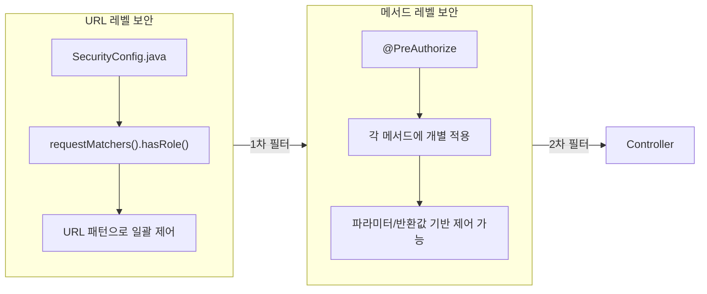
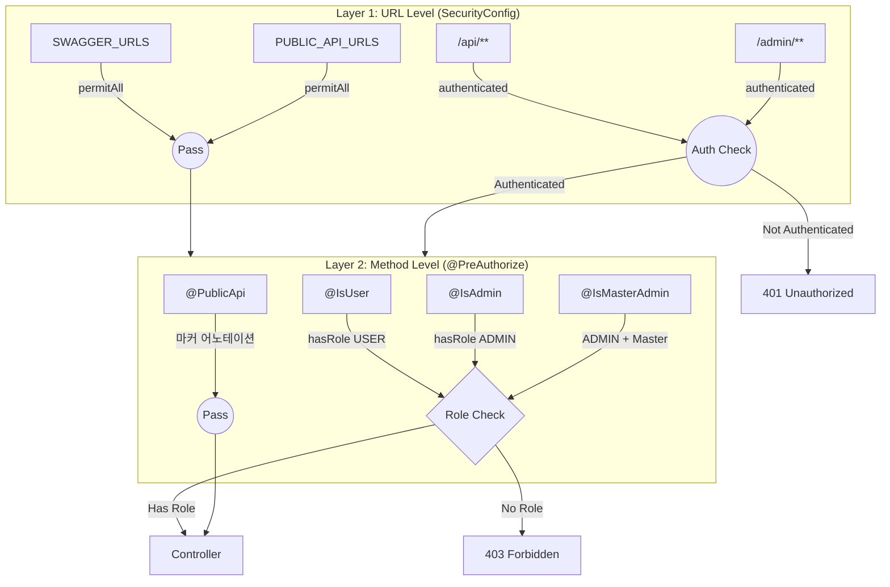
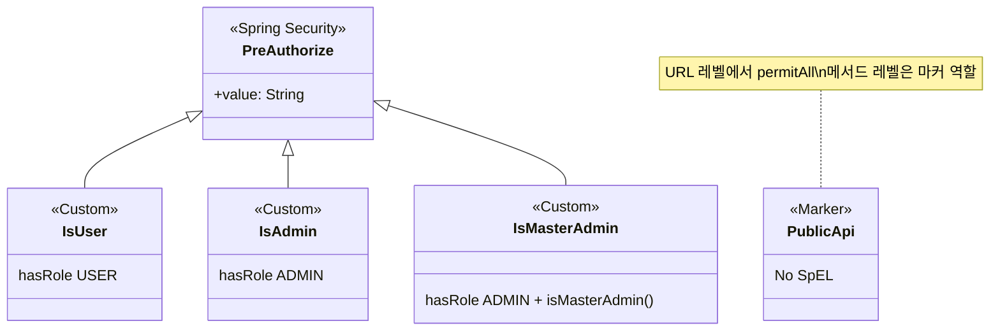
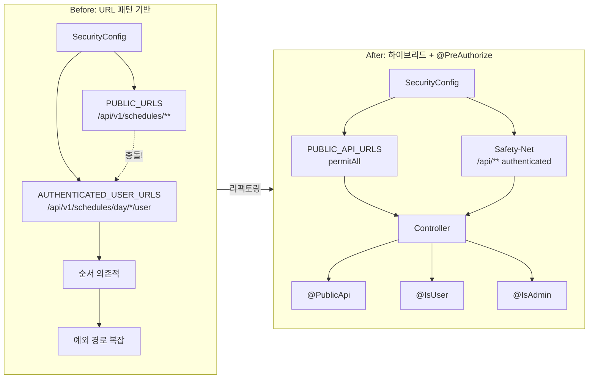
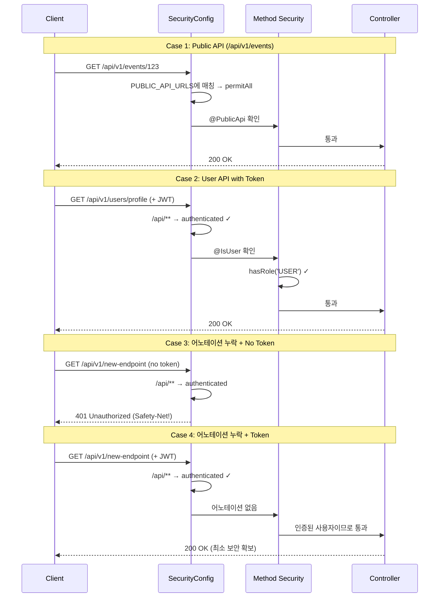

# Security 리팩토링 설계: @PreAuthorize 기반 메서드 레벨 보안

## 1. 현재 문제점

### 1.1 URL 패턴 충돌
```java
PUBLIC_URLS = { "/api/v1/schedules/**" }
AUTHENTICATED_USER_URLS = { "/api/v1/schedules/day/*/user" }
```
- 와일드카드(`/**`) 사용으로 인한 패턴 충돌
- 순서에 따라 의도치 않은 권한 적용
- 예외 경로를 별도 배열로 분리해야 하는 복잡성

### 1.2 권한 정책 파편화
- Security 설정과 실제 컨트롤러가 분리되어 있어 파악 어려움
- 새로운 엔드포인트 추가 시 두 곳 수정 필요
- 세밀한 권한 제어 불가 (예: 리소스 소유자 확인)

---

## 2. 리팩토링 목표

1. **명확성**: 각 엔드포인트의 권한이 코드에서 바로 보임
2. **유연성**: 파라미터 기반 권한 체크 가능 (소유자 확인 등)
3. **유지보수성**: 새 엔드포인트 추가 시 한 곳만 수정
4. **일관성**: 커스텀 어노테이션으로 팀 전체 표준화
5. **안전성**: 어노테이션 누락 시에도 최소한의 보안 보장 (Safety-Net)

---

## 3. 핵심 개념 설명

> 이 문서를 이해하기 위해 필요한 핵심 개념들을 설명합니다.

### 3.1 URL 레벨 보안 vs 메서드 레벨 보안

Spring Security는 두 가지 레벨에서 권한을 체크할 수 있습니다:



| 구분 | URL 레벨 | 메서드 레벨 |
|------|----------|------------|
| **설정 위치** | `SecurityConfig.java` | 각 Controller 메서드 |
| **설정 방식** | `requestMatchers("/api/**").hasRole("USER")` | `@PreAuthorize("hasRole('USER')")` |
| **장점** | 한 곳에서 전체 관리 | 세밀한 제어, 코드와 권한이 함께 |
| **단점** | 와일드카드 충돌, 세밀한 제어 어려움 | 어노테이션 누락 위험 |
| **실무 사용** | 대략적인 접근 제어 | 세밀한 비즈니스 로직 기반 제어 |

### 3.2 메서드 레벨 보안이란?

**컨트롤러의 각 메서드에 직접 권한 체크 로직을 적용하는 방식**입니다.

```java
// URL 레벨 보안 (SecurityConfig에서 일괄 설정)
.requestMatchers("/api/v1/users/**").hasRole("USER")

// 메서드 레벨 보안 (각 메서드에 개별 설정)
@PreAuthorize("hasRole('USER')")
@GetMapping("/profile")
public ResponseEntity<?> getProfile() { }
```

**메서드 레벨 보안의 강점: 파라미터/반환값 기반 제어**

```java
// 예시 1: 자기 자신의 데이터만 접근 가능
@PreAuthorize("#userId == authentication.principal.id")
public User getUser(@PathVariable Long userId) { }

// 예시 2: 리소스 소유자만 삭제 가능
@PreAuthorize("@documentService.isOwner(#docId, authentication.name)")
public void deleteDocument(@PathVariable Long docId) { }

// 예시 3: 반환값 기반 필터링
@PostFilter("filterObject.owner == authentication.name")
public List<Document> getDocuments() { }
```

URL 레벨에서는 이런 세밀한 제어가 불가능합니다.

### 3.3 @EnableMethodSecurity란?

**메서드 레벨 보안 어노테이션을 활성화하는 설정**입니다.

```java
@Configuration
@EnableWebSecurity
@EnableMethodSecurity  // ← 이거 없으면 @PreAuthorize가 무시됨!
public class SecurityConfig { }
```

| @EnableMethodSecurity | @PreAuthorize 동작 |
|----------------------|-------------------|
| **없음** | 완전 무시됨 (누구나 접근 가능) |
| **있음** | 정상 동작 (권한 체크) |

**Spring Security 버전별 차이:**
```java
// Spring Security 5.x (deprecated)
@EnableGlobalMethodSecurity(prePostEnabled = true)

// Spring Security 6.x (현재 권장)
@EnableMethodSecurity  // prePostEnabled = true가 기본값
```

### 3.4 Safety-Net이란?

**"안전망"** - 개발자가 실수로 어노테이션을 누락해도 최소한의 보안이 유지되도록 하는 장치입니다.

```java
// Safety-Net 설정
.requestMatchers("/api/**").authenticated()  // 나머지 API는 최소 인증 필요
```

**Safety-Net의 효과:**

| 상황 | Safety-Net 없음 | Safety-Net 있음 |
|------|----------------|----------------|
| 새 API 추가 + 어노테이션 누락 | **완전 Public 노출** (보안 사고) | 최소 인증 필요 (안전) |

**실무에서의 명칭:**
- **Fail-Open**: 기본 허용 → 명시적 차단 (위험한 정책)
- **Fail-Close**: 기본 차단 → 명시적 허용 (안전한 정책) ← Safety-Net

**Spring Security 공식 문서 권장:**
```java
// 가장 엄격한 Safety-Net
.anyRequest().denyAll()

// 약간 유연한 Safety-Net (이 문서에서 채택)
.anyRequest().authenticated()
```

### 3.5 @PublicApi의 "마커 역할"이란?

`@PublicApi`는 **실제 권한 체크를 하지 않고, 의도를 표시만 하는 어노테이션**입니다.

```java
// @PublicApi 정의 - @PreAuthorize 없음!
@Target({ElementType.METHOD, ElementType.TYPE})
@Retention(RetentionPolicy.RUNTIME)
public @interface PublicApi {
    // 비어있음 - 권한 체크 로직 없음
}

// 비교: @IsUser - @PreAuthorize 있음
@PreAuthorize("hasRole('USER')")  // ← 실제 권한 체크
public @interface IsUser { }
```

**왜 마커 역할인가?**

```
Public API의 권한 처리 흐름:

1. URL 레벨 (SecurityConfig)
   └─ /api/v1/events/** → permitAll()  ← 여기서 실제 허용!

2. 메서드 레벨 (@PublicApi)
   └─ 권한 체크 안 함
   └─ 단지 "이 API는 의도적으로 Public"이라고 표시만 함
   └─ 자동화 테스트에서 "어노테이션 존재 여부" 검증에 활용
```

**@PublicApi가 필요한 이유:**
1. **명시성**: "어노테이션 없음 = Public" vs "**@PublicApi = 의도적으로 Public**"
2. **자동화 테스트**: 모든 API에 어노테이션이 있는지 검증 가능
3. **코드 리뷰**: Public API임을 한눈에 파악 가능

---

## 4. 아키텍처 다이어그램

### 4.1 요청 처리 흐름 (Request Flow)

```mermaid
flowchart TD
    A[Client Request] --> B{JwtFilter}
    B -->|No Token| C[Anonymous User]
    B -->|Valid Token| D[Authenticated User]
    B -->|Invalid Token| E[401 Unauthorized]

    C --> F{URL Level Check<br/>SecurityConfig}
    D --> F

    F -->|PUBLIC_API_URLS| G[permitAll]
    F -->|/api/** 나머지| H{authenticated?}
    F -->|/admin/**| I{authenticated?}

    H -->|No| E
    H -->|Yes| J{Method Level Check<br/>@PreAuthorize}
    I -->|No| E
    I -->|Yes| J
    G --> J

    J -->|@PublicApi| K[Controller Method]
    J -->|@IsUser + ROLE_USER| K
    J -->|@IsUser + No Role| L[403 Forbidden]
    J -->|@IsAdmin + ROLE_ADMIN| K
    J -->|@IsAdmin + No Role| L
    J -->|No Annotation| M[Safety-Net:<br/>authenticated만 통과]

    K --> N[Response]
    M --> K
```

### 4.2 보안 계층 구조 (Security Layers)



### 4.3 어노테이션 계층 구조



### 4.4 Before vs After 비교



### 4.5 Safety-Net 동작 원리



---

## 5. 상세 설계

### 5.1 권한 레벨 정의

| 어노테이션 | 대상 | 설명 |
|-----------|------|------|
| `@PublicApi` | PUBLIC | 인증 불필요 (명시적 선언) |
| `@IsUser` | ROLE_USER | 일반 사용자 |
| `@IsAdmin` | ROLE_ADMIN | 관리자 |
| `@IsMasterAdmin` | ROLE_ADMIN + MASTER | 마스터 관리자 |

### 5.2 커스텀 어노테이션 설계

```
src/main/java/side/onetime/auth/annotation/
├── PublicApi.java          # PUBLIC API (명시적 선언)
├── IsUser.java             # 일반 사용자
├── IsAdmin.java            # 관리자
└── IsMasterAdmin.java      # 마스터 관리자
```

#### PublicApi.java (신규)
```java
/**
 * Public API임을 명시적으로 선언하는 어노테이션.
 * 이 어노테이션이 없고, 다른 권한 어노테이션도 없으면
 * SecurityConfig의 Safety-Net에 의해 인증이 요구됨.
 */
@Target({ElementType.METHOD, ElementType.TYPE})
@Retention(RetentionPolicy.RUNTIME)
@Documented
public @interface PublicApi {
}
```

#### IsUser.java
```java
@Target({ElementType.METHOD, ElementType.TYPE})
@Retention(RetentionPolicy.RUNTIME)
@Documented
@PreAuthorize("hasRole('USER')")
public @interface IsUser {
}
```

#### IsAdmin.java
```java
@Target({ElementType.METHOD, ElementType.TYPE})
@Retention(RetentionPolicy.RUNTIME)
@Documented
@PreAuthorize("hasRole('ADMIN')")
public @interface IsAdmin {
}
```

#### IsMasterAdmin.java
```java
@Target({ElementType.METHOD, ElementType.TYPE})
@Retention(RetentionPolicy.RUNTIME)
@Documented
@PreAuthorize("hasRole('ADMIN') and @adminAuthorizationService.isMasterAdmin()")
public @interface IsMasterAdmin {
}
```

### 5.3 Security 설정: 하이브리드 접근법 (Safety-Net)

> **핵심 원칙**: URL 레벨에서 Safety-Net을 제공하고, 메서드 레벨에서 세밀한 권한 체크

**Before (복잡한 URL 패턴)**
```java
.authorizeHttpRequests(authorize -> authorize
    .requestMatchers(PUBLIC_EXCEPTION_URLS).permitAll()
    .requestMatchers(AUTHENTICATED_USER_URLS).hasRole("USER")
    .requestMatchers(AUTHENTICATED_ADMIN_URLS).hasRole("ADMIN")
    .requestMatchers(PUBLIC_URLS).permitAll()
    .anyRequest().authenticated()
)
```

**After (하이브리드 Safety-Net)**
```java
// Public API 경로 (명시적으로 허용)
private static final String[] PUBLIC_API_URLS = {
    "/api/v1/events/**",
    "/api/v1/schedules/**",      // 하위의 /user는 @IsUser로 보호
    "/api/v1/members/**",
    "/api/v1/urls/**",
    "/api/v1/tokens/**",
    "/api/v1/users/onboarding",
    "/api/v1/users/logout",
    "/api/v1/admin/register",
    "/api/v1/admin/login",
    "/api/v1/banners/activated/all",
    "/api/v1/bar-banners/activated/all",
    "/api/v1/banners/*/clicks",
    "/api/v1/test/**",
};

@Bean
public SecurityFilterChain filterChain(HttpSecurity http) throws Exception {
    http
        .authorizeHttpRequests(authorize -> authorize
            // 1. Swagger, Actuator 등 인프라 엔드포인트
            .requestMatchers(SWAGGER_URLS).permitAll()
            .requestMatchers("/actuator/**").permitAll()

            // 2. 명시적 Public API
            .requestMatchers(PUBLIC_API_URLS).permitAll()

            // 3. Admin 페이지 (웹)
            .requestMatchers("/admin/login", "/admin/login/**").permitAll()
            .requestMatchers("/admin/**").authenticated()

            // 4. Safety-Net: 나머지 API는 최소 인증 필요
            .requestMatchers("/api/**").authenticated()

            // 5. 그 외 (정적 리소스 등)
            .anyRequest().permitAll()
        )
        // ... 기타 설정
    return http.build();
}
```

**Safety-Net의 장점**:
1. 어노테이션 누락 시에도 최소한 **인증된 사용자**만 접근 가능
2. 완전한 Public 노출 방지 (Fail-Close에 가까운 정책)
3. Public API는 URL 레벨에서 명시적으로 허용

### 5.4 컨트롤러 적용 예시

#### UserController
```java
@RestController
@RequestMapping("/api/v1/users")
public class UserController {

    // PUBLIC - @PublicApi로 의도 명시 (URL 레벨에서 permitAll)
    @PublicApi
    @PostMapping("/onboarding")
    public ResponseEntity<?> onboarding(...) { }

    @PublicApi
    @PostMapping("/logout")
    public ResponseEntity<?> logout(...) { }

    // USER 권한 필요 - @IsUser로 메서드 레벨 보호
    @IsUser
    @GetMapping("/profile")
    public ResponseEntity<?> getProfile() { }

    @IsUser
    @PatchMapping("/profile/action-update")
    public ResponseEntity<?> updateProfile(...) { }

    @IsUser
    @PostMapping("/action-withdraw")
    public ResponseEntity<?> withdraw() { }
}
```

#### ScheduleController
```java
@RestController
@RequestMapping("/api/v1/schedules")
public class ScheduleController {

    // PUBLIC - URL 레벨에서 /api/v1/schedules/** 허용됨
    @PublicApi
    @GetMapping("/day/{event_id}")
    public ResponseEntity<?> getAllDaySchedules(...) { }

    // USER 권한 필요 - @IsUser가 URL 허용을 오버라이드
    @IsUser
    @GetMapping("/day/{event_id}/user")
    public ResponseEntity<?> getUserDaySchedules(...) { }
}
```

#### AdminController
```java
@RestController
@RequestMapping("/api/v1/admin")
public class AdminController {

    // PUBLIC
    @PublicApi
    @PostMapping("/register")
    public ResponseEntity<?> register(...) { }

    @PublicApi
    @PostMapping("/login")
    public ResponseEntity<?> login(...) { }

    // ADMIN 권한 필요
    @IsAdmin
    @GetMapping("/profile")
    public ResponseEntity<?> getProfile() { }

    // MASTER 권한 필요
    @IsMasterAdmin
    @GetMapping("/all")
    public ResponseEntity<?> getAllAdmins() { }

    @IsMasterAdmin
    @PatchMapping("/status")
    public ResponseEntity<?> updateAdminStatus(...) { }
}
```

---

## 6. 엔드포인트별 권한 매핑

### 6.1 EventController (`/api/v1/events`)

| 메서드 | 엔드포인트 | 현재 | 변경 후 |
|--------|-----------|------|---------|
| POST | `/` | PUBLIC | `@PublicApi` |
| GET | `/{event_id}` | PUBLIC | `@PublicApi` |
| GET | `/{event_id}/participants` | PUBLIC | `@PublicApi` |
| GET | `/{event_id}/most` | PUBLIC | `@PublicApi` |
| POST | `/{event_id}/most/filtering` | PUBLIC | `@PublicApi` |
| GET | `/user/all` | USER | `@IsUser` |
| DELETE | `/{event_id}` | USER | `@IsUser` |
| PATCH | `/{event_id}` | USER | `@IsUser` |
| GET | `/qr/{event_id}` | PUBLIC | `@PublicApi` |

### 6.2 ScheduleController (`/api/v1/schedules`)

| 메서드 | 엔드포인트 | 현재 | 변경 후 |
|--------|-----------|------|---------|
| POST | `/day` | PUBLIC | `@PublicApi` |
| POST | `/date` | PUBLIC | `@PublicApi` |
| GET | `/day/{event_id}` | PUBLIC | `@PublicApi` |
| GET | `/day/{event_id}/{member_id}` | PUBLIC | `@PublicApi` |
| GET | `/day/{event_id}/user` | USER | `@IsUser` |
| POST | `/day/{event_id}/filtering` | PUBLIC | `@PublicApi` |
| GET | `/date/{event_id}` | PUBLIC | `@PublicApi` |
| GET | `/date/{event_id}/{member_id}` | PUBLIC | `@PublicApi` |
| GET | `/date/{event_id}/user` | USER | `@IsUser` |
| POST | `/date/{event_id}/filtering` | PUBLIC | `@PublicApi` |

### 6.3 UserController (`/api/v1/users`)

| 메서드 | 엔드포인트 | 현재 | 변경 후 |
|--------|-----------|------|---------|
| POST | `/onboarding` | PUBLIC | `@PublicApi` |
| POST | `/logout` | PUBLIC | `@PublicApi` |
| GET | `/profile` | USER | `@IsUser` |
| PATCH | `/profile/action-update` | USER | `@IsUser` |
| POST | `/action-withdraw` | USER | `@IsUser` |
| GET | `/policy` | USER | `@IsUser` |
| PUT | `/policy` | USER | `@IsUser` |
| GET | `/sleep-time` | USER | `@IsUser` |
| PUT | `/sleep-time` | USER | `@IsUser` |
| POST | `/guides/view-log` | USER | `@IsUser` |
| GET | `/guides/view-log` | USER | `@IsUser` |
| DELETE | `/guides/view-log` | USER | `@IsUser` |

### 6.4 MemberController (`/api/v1/members`)

| 메서드 | 엔드포인트 | 현재 | 변경 후 |
|--------|-----------|------|---------|
| POST | `/action-register` | PUBLIC | `@PublicApi` |
| POST | `/action-login` | PUBLIC | `@PublicApi` |
| POST | `/name/action-check` | PUBLIC | `@PublicApi` |

### 6.5 TokenController (`/api/v1/tokens`)

| 메서드 | 엔드포인트 | 현재 | 변경 후 |
|--------|-----------|------|---------|
| POST | `/action-reissue` | PUBLIC | `@PublicApi` |

### 6.6 UrlController (`/api/v1/urls`)

| 메서드 | 엔드포인트 | 현재 | 변경 후 |
|--------|-----------|------|---------|
| POST | `/action-shorten` | PUBLIC | `@PublicApi` |
| POST | `/action-original` | PUBLIC | `@PublicApi` |

### 6.7 FixedController (`/api/v1/fixed-schedules`)

| 메서드 | 엔드포인트 | 현재 | 변경 후 |
|--------|-----------|------|---------|
| GET | `/` | USER | `@IsUser` |
| PUT | `/` | USER | `@IsUser` |
| GET | `/everytime/{identifier}` | USER | `@IsUser` |

### 6.8 AdminController (`/api/v1/admin`)

| 메서드 | 엔드포인트 | 현재 | 변경 후 |
|--------|-----------|------|---------|
| POST | `/register` | PUBLIC | `@PublicApi` |
| POST | `/login` | PUBLIC | `@PublicApi` |
| GET | `/profile` | ADMIN | `@IsAdmin` |
| GET | `/all` | ADMIN (MASTER) | `@IsMasterAdmin` |
| PATCH | `/status` | ADMIN (MASTER) | `@IsMasterAdmin` |
| POST | `/withdraw` | ADMIN | `@IsAdmin` |
| GET | `/dashboard/events` | ADMIN | `@IsAdmin` |
| GET | `/dashboard/users` | ADMIN | `@IsAdmin` |

### 6.9 BannerController (`/api/v1/banners`, `/api/v1/bar-banners`)

| 메서드 | 엔드포인트 | 현재 | 변경 후 |
|--------|-----------|------|---------|
| GET | `/banners/activated/all` | PUBLIC | `@PublicApi` |
| GET | `/bar-banners/activated/all` | PUBLIC | `@PublicApi` |
| PATCH | `/banners/{id}/clicks` | PUBLIC | `@PublicApi` |
| POST | `/banners/register` | ADMIN | `@IsAdmin` |
| POST | `/bar-banners/register` | ADMIN | `@IsAdmin` |
| GET | `/banners/{id}` | ADMIN | `@IsAdmin` |
| GET | `/bar-banners/{id}` | ADMIN | `@IsAdmin` |
| GET | `/banners/all` | ADMIN | `@IsAdmin` |
| GET | `/bar-banners/all` | ADMIN | `@IsAdmin` |
| PATCH | `/banners/{id}` | ADMIN | `@IsAdmin` |
| PATCH | `/bar-banners/{id}` | ADMIN | `@IsAdmin` |
| DELETE | `/banners/{id}` | ADMIN | `@IsAdmin` |
| DELETE | `/bar-banners/{id}` | ADMIN | `@IsAdmin` |

### 6.10 AdminPageController (`/admin`)

| 메서드 | 엔드포인트 | 현재 | 변경 후 |
|--------|-----------|------|---------|
| GET | `/login` | PUBLIC | `@PublicApi` |
| POST | `/login` | PUBLIC | `@PublicApi` |
| GET | `/logout` | ADMIN | `@IsAdmin` |
| GET | `/dashboard` | ADMIN | `@IsAdmin` |
| GET | `/statistics/users` | ADMIN | `@IsAdmin` |
| GET | `/statistics/events` | ADMIN | `@IsAdmin` |
| GET | `/statistics/retention` | ADMIN | `@IsAdmin` |
| GET | `/statistics/marketing` | ADMIN | `@IsAdmin` |

### 6.11 AdminStatisticsApiController (`/admin/api/statistics`)

| 메서드 | 엔드포인트 | 현재 | 변경 후 |
|--------|-----------|------|---------|
| GET | `/marketing/agreed` | ADMIN | `@IsAdmin` |
| GET | `/marketing/dormant` | ADMIN | `@IsAdmin` |
| GET | `/marketing/no-event` | ADMIN | `@IsAdmin` |
| GET | `/marketing/one-time` | ADMIN | `@IsAdmin` |
| GET | `/marketing/vip` | ADMIN | `@IsAdmin` |
| GET | `/marketing/zero-participant` | ADMIN | `@IsAdmin` |

### 6.12 TestAuthController (`/api/v1/test/auth`)

| 메서드 | 엔드포인트 | 현재 | 변경 후 |
|--------|-----------|------|---------|
| POST | `/login` | PUBLIC | `@PublicApi` |
| POST | `/expired-token` | PUBLIC | `@PublicApi` |

---

## 7. 구현 단계

### Phase 1: 기반 구축
1. `@EnableMethodSecurity` 활성화
2. 커스텀 어노테이션 생성 (`@PublicApi`, `@IsUser`, `@IsAdmin`, `@IsMasterAdmin`)
3. `AdminAuthorizationService` 생성 (마스터 관리자 체크용)

### Phase 2: 컨트롤러 적용
1. AdminController, AdminPageController, AdminStatisticsApiController 적용
2. UserController 적용
3. ScheduleController 적용
4. EventController 적용
5. FixedController 적용
6. BannerController 적용
7. 나머지 컨트롤러 (Member, Token, Url, Test) 적용

### Phase 3: Security 설정 변경
1. URL 패턴 배열을 하이브리드 방식으로 재구성
2. Safety-Net 적용 (`/api/**` → `authenticated()`)

### Phase 4: 검증
1. 기존 테스트 통과 확인
2. 어노테이션 누락 검증 테스트 추가 (자동화)
3. 권한 필수 테스트 추가 (USER/ADMIN 필요 엔드포인트에 인증 없이 접근 시 401)

---

## 8. 보안 고려사항

### 8.1 Safety-Net 전략 (Gemini 리뷰 반영)

**핵심 원칙**: "기본 차단(Fail-Close)"에 가까운 정책 채택

```
요청 흐름:
1. URL 레벨 체크 (SecurityConfig)
   └─ PUBLIC_API_URLS에 있으면 → permitAll
   └─ /api/** 인데 PUBLIC이 아니면 → authenticated (Safety-Net)

2. 메서드 레벨 체크 (@PreAuthorize)
   └─ @IsUser, @IsAdmin 등으로 세밀한 권한 체크
```

**Safety-Net의 효과**:
- 개발자가 `/api/**` 하위에 새 엔드포인트 추가 시 어노테이션 누락해도
- `authenticated()`에 의해 최소한 인증된 사용자만 접근 가능
- 완전한 Public 노출 방지

### 8.2 @PublicApi 어노테이션의 역할

`@PublicApi`는 SpEL을 사용하지 않는 **마커 어노테이션**:
- 코드에서 "이 API는 의도적으로 Public"임을 명시
- URL 레벨에서 permitAll 처리 (어노테이션 자체는 권한 체크 안 함)
- 자동화 테스트에서 누락 검증에 활용

### 8.3 자동화된 어노테이션 누락 검증 테스트

```java
@SpringBootTest
class SecurityAnnotationTest {

    @Autowired
    private ApplicationContext applicationContext;

    @Test
    @DisplayName("모든 API 엔드포인트는 권한 어노테이션이 있어야 한다")
    void allApiEndpointsShouldHaveSecurityAnnotation() {
        Map<String, Object> controllers = applicationContext.getBeansWithAnnotation(RestController.class);

        List<String> missingAnnotations = new ArrayList<>();

        for (Object controller : controllers.values()) {
            Class<?> clazz = AopUtils.getTargetClass(controller);

            for (Method method : clazz.getDeclaredMethods()) {
                if (!hasRequestMapping(method)) continue;
                if (!isApiEndpoint(method, clazz)) continue;

                if (!hasSecurityAnnotation(method) && !hasSecurityAnnotation(clazz)) {
                    missingAnnotations.add(clazz.getSimpleName() + "." + method.getName());
                }
            }
        }

        assertThat(missingAnnotations)
            .as("다음 메서드에 보안 어노테이션(@PublicApi, @IsUser, @IsAdmin 등)이 누락됨")
            .isEmpty();
    }

    private boolean hasSecurityAnnotation(AnnotatedElement element) {
        return element.isAnnotationPresent(PublicApi.class)
            || element.isAnnotationPresent(IsUser.class)
            || element.isAnnotationPresent(IsAdmin.class)
            || element.isAnnotationPresent(IsMasterAdmin.class)
            || element.isAnnotationPresent(PreAuthorize.class);
    }

    private boolean hasRequestMapping(Method method) {
        return method.isAnnotationPresent(RequestMapping.class)
            || method.isAnnotationPresent(GetMapping.class)
            || method.isAnnotationPresent(PostMapping.class)
            || method.isAnnotationPresent(PutMapping.class)
            || method.isAnnotationPresent(PatchMapping.class)
            || method.isAnnotationPresent(DeleteMapping.class);
    }

    private boolean isApiEndpoint(Method method, Class<?> clazz) {
        // /api/** 또는 /admin/** 경로인지 확인
        RequestMapping classMapping = clazz.getAnnotation(RequestMapping.class);
        if (classMapping != null) {
            String[] paths = classMapping.value();
            for (String path : paths) {
                if (path.startsWith("/api/") || path.startsWith("/admin")) {
                    return true;
                }
            }
        }
        return false;
    }
}
```

**테스트 효과**:
- CI/CD 파이프라인에서 자동으로 어노테이션 누락 검출
- 새 엔드포인트 추가 시 강제로 권한 어노테이션 요구

---

## 9. 롤백 계획

문제 발생 시:
1. `@EnableMethodSecurity` 제거
2. 기존 SecurityConfig의 URL 패턴 복원
3. 커스텀 어노테이션은 그대로 둬도 무방 (동작하지 않음)

---

## 10. 파일 변경 목록

### 신규 생성
- `src/main/java/side/onetime/auth/annotation/PublicApi.java`
- `src/main/java/side/onetime/auth/annotation/IsUser.java`
- `src/main/java/side/onetime/auth/annotation/IsAdmin.java`
- `src/main/java/side/onetime/auth/annotation/IsMasterAdmin.java`
- `src/main/java/side/onetime/auth/service/AdminAuthorizationService.java`
- `src/test/java/side/onetime/security/SecurityAnnotationTest.java`

### 수정
- `SecurityConfig.java` - `@EnableMethodSecurity` 추가, 하이브리드 Safety-Net 적용
- `EventController.java` - `@PublicApi` 6개, `@IsUser` 3개
- `ScheduleController.java` - `@PublicApi` 8개, `@IsUser` 2개
- `UserController.java` - `@PublicApi` 2개, `@IsUser` 10개
- `MemberController.java` - `@PublicApi` 3개
- `TokenController.java` - `@PublicApi` 1개
- `UrlController.java` - `@PublicApi` 2개
- `FixedController.java` - `@IsUser` 3개
- `AdminController.java` - `@PublicApi` 2개, `@IsAdmin` 4개, `@IsMasterAdmin` 2개
- `BannerController.java` - `@PublicApi` 3개, `@IsAdmin` 10개
- `AdminPageController.java` - `@PublicApi` 2개, `@IsAdmin` 6개
- `AdminStatisticsApiController.java` - `@IsAdmin` 6개
- `TestAuthController.java` - `@PublicApi` 2개

---

## 11. 예상 효과

1. **코드 가독성 향상**: 권한이 메서드 바로 위에 명시
2. **유지보수 용이**: 새 엔드포인트 추가 시 한 곳만 수정
3. **URL 패턴 충돌 해소**: 와일드카드 패턴 문제 완전 해결
4. **세밀한 권한 제어 가능**: 추후 `@PreAuthorize("#id == authentication.principal.id")` 등 확장 가능
5. **팀 표준화**: 커스텀 어노테이션으로 일관된 권한 체계
6. **Safety-Net 보호**: 어노테이션 누락 시에도 최소 보안 보장
7. **자동화 검증**: CI/CD에서 보안 설정 누락 자동 검출

---

## 12. 리뷰 이력

| 날짜 | 리뷰어 | 주요 피드백 |
|------|--------|-------------|
| 2026-01-26 | Gemini | 하이브리드 Safety-Net, @PublicApi 어노테이션, 자동화 테스트 제안 |
